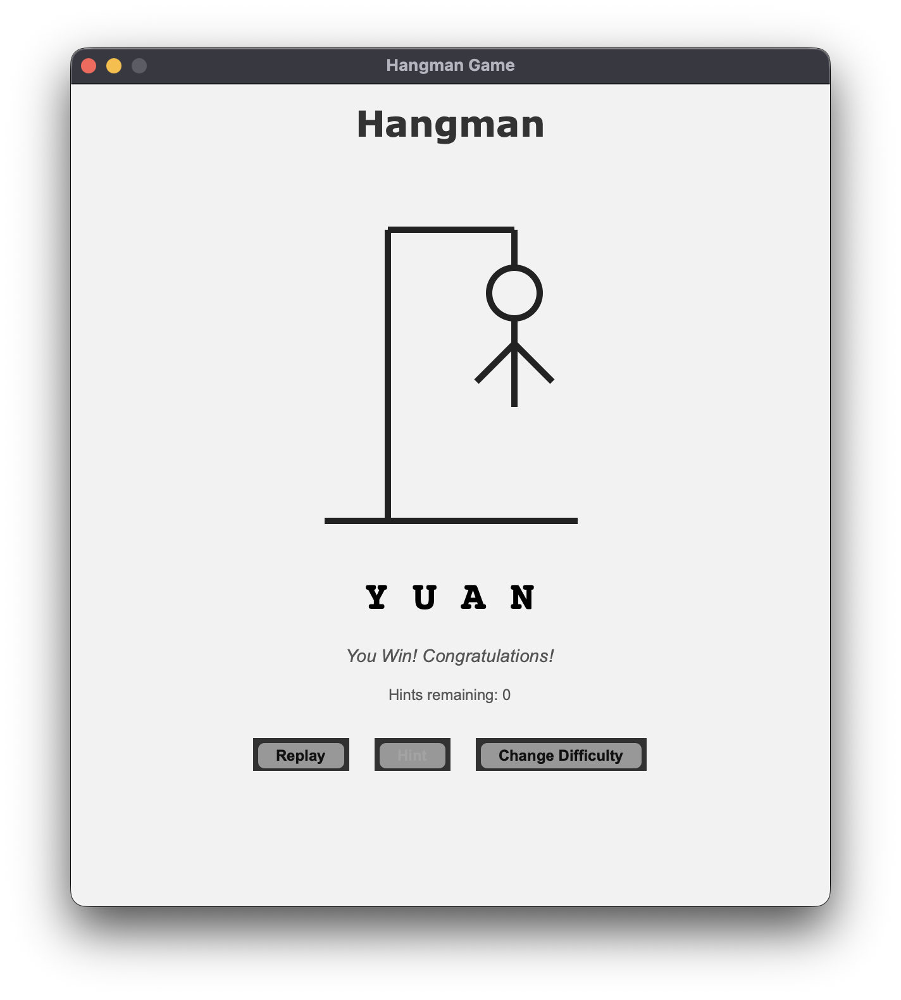

# 🧩 Python Hangman GUI

A modern, graphical Hangman game built with Python and Tkinter.  
This project includes a clean GUI, real-time word fetching from an API, a fallback system, multiple difficulty levels, and a hint mechanism — all in a single Python file.

  
*(Make sure this image is stored at `assets/gameplay.png` in your repository.)*

---

## 🚀 Features

- GUI built using Tkinter (no command-line interface)
- Real-time word generation via the [Random Word API](https://random-word-api.herokuapp.com/)
- Three difficulty levels:
  - **Easy:** 4–6 letter words, 3 hints  
  - **Medium:** 7–9 letter words, 2 hints  
  - **Hard:** 10+ letter words, 1 hint  
- Visual Hangman drawing that updates as you make mistakes  
- Hint system that reveals a random letter  
- Smooth transitions between the start screen and game screen  
- Offline fallback words if the API is unreachable  
- Fully responsive gameplay and error handling  

---

## 🧠 How It Works

The game launches a Tkinter window with two main screens:
1. **Start Screen:** Lets the player select the difficulty level.  
2. **Game Screen:** Displays the gallows, hidden word, guess input, and hint button.

Each key press is registered as a guess.  
Correct guesses fill in letters, while incorrect ones draw hangman parts step by step.  
When you win or lose, the interface updates with appropriate messages, and you can easily return to the difficulty menu.

---

## 🧾 Requirements

- Python 3.x
- `requests` library (for API calls)
- Tkinter (included by default with most Python installations)

You can install the external dependency using:
```bash
pip install requests
```

---

## ⚙️ Installation and Running

- Clone the repository
```
git clone https://github.com/CaSh007s/python-hangman-gui.git
cd python-hangman-gui
```

- Create and activate a virtual environment (recommended)
```
Windows:

python -m venv .venv
.venv\Scripts\activate


macOS/Linux:

python3 -m venv .venv
source .venv/bin/activate
```

- Install dependencies
```
pip install -r requirements.txt
```

- Run the game
```
python hangman_game.py
```

---

## 📂 Project Structure

```
python-hangman-gui/
├── .gitignore          # Ignore virtual environment and cache files
├── hangman_game.py     # Main Python script (complete GUI logic)
├── requirements.txt    # External dependency list
├── README.md           # This documentation
└── assets/
    └── gameplay.png    # Screenshot of the game interface
```
---

## 🧩 Troubleshooting

- Tkinter not installed (Linux)
```
Install with:

sudo apt-get install python3-tk
```

- Requests not installed
```
pip install requests
```

- API unreachable
```
The game automatically switches to fallback mode — no user action needed.
```

---

## 🪶 Author

CaSh007s
```
Built with Python, Tkinter, and lots of patience.
```

---

## 📜 License

This project is licensed under the MIT License.
You can freely use, modify, and distribute it.

---
